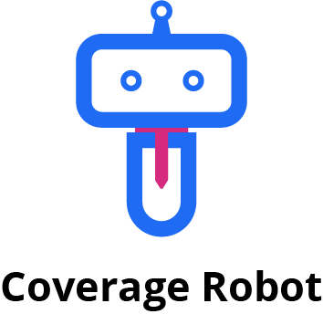

    

    

The core platform for ingesting, analysing, and publishing coverage data to Version Control platforms.

## Description

Coverage Robot is the only code coverage analysis solution specifically engineered for monorepos.

Through [the GitHub Action](https://github.com/coverage-robot/action) coverage reports from automation tests can be
analysed and results reported back on Pull Requests in seconds, and with support for intelligently carrying forward
coverage data from previous commits, you never have to run tests for unchanged parts of your code again.

Check out a real Pull Request with coverage analysis directly in [the monorepo](https://github.com/coverage-robot/core/pull/2218).

## Architecture

## Folder Structure

- [`infrastructure/`](infrastructure/)

The _global_ IaC modules to construct the static parts of the infrastructure (e.g. S3 buckets, event buses, caches,
etc).

- [`packages/`](packages/)

The _shared_ packages that are used across the microservices.

- [`services/`](services/)

The _independent_ services which are deployed to handle parts of the pipeline.

## Deployment

Theres two key parts of the deployment model of the coverage platform, both of which are handled by Terraform.

Broadly those are:

1. The _global_ infrastructure which exists outside of any particular service.
2. The _service-specific_ infrastructure, which is managed by the service itself, and deployed _alongside_ the service.